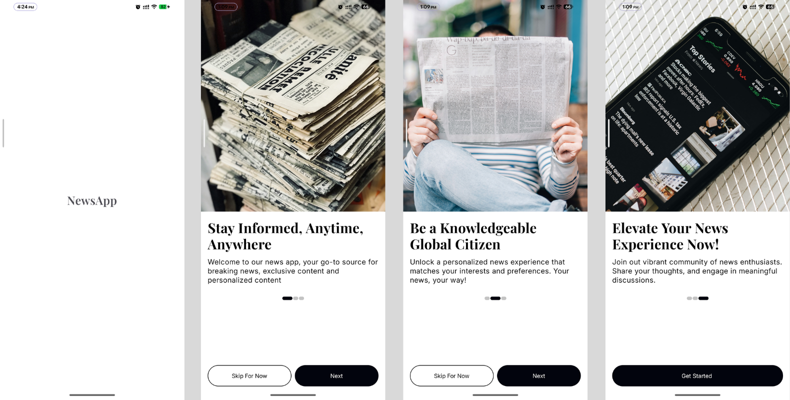
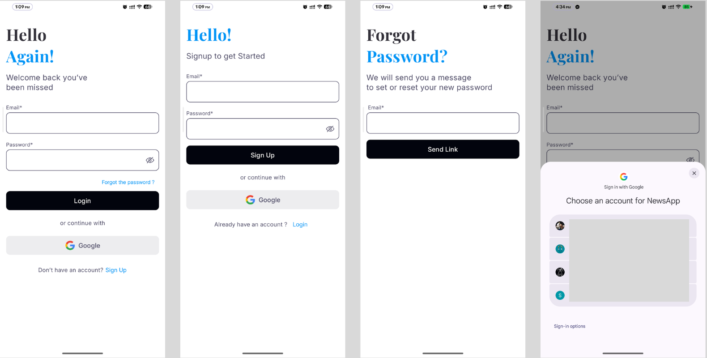
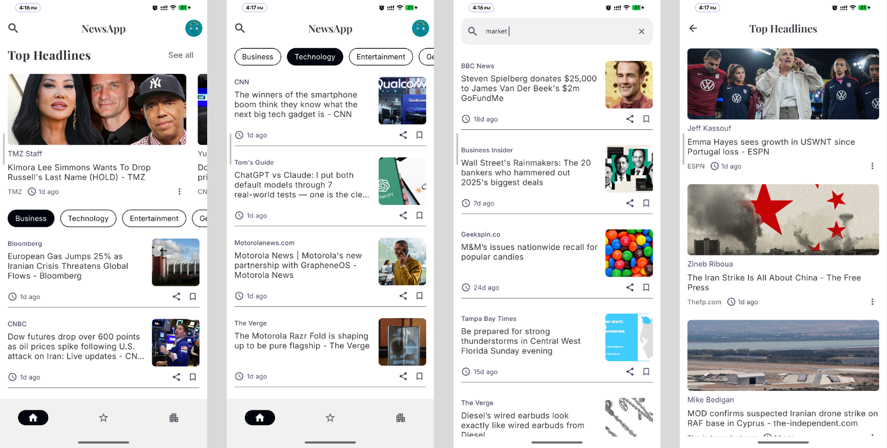
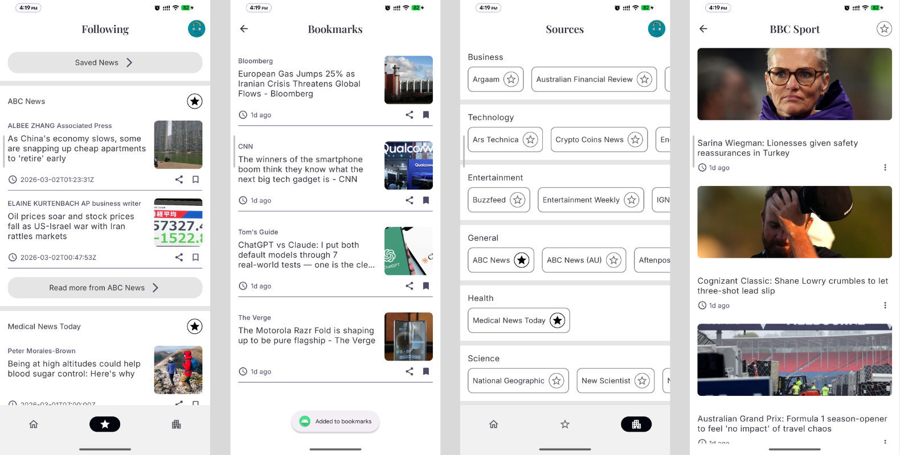
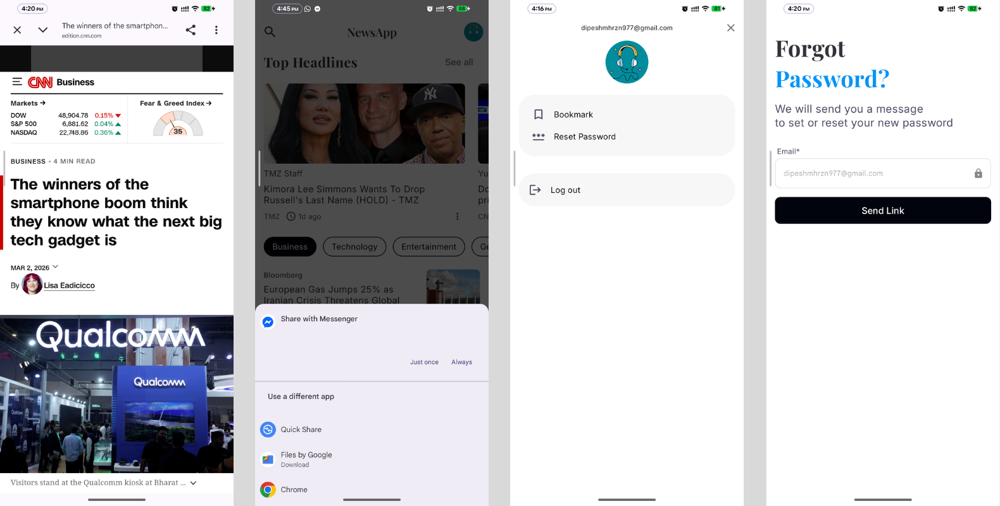

# News App

A modern and clean **News Application** built using **Kotlin** and **Jetpack Compose** for Android.
The app follows **MVVM + Clean Architecture** principles and focuses on scalable architecture, state management, and real-world Android development practices.

It integrates **Firebase Authentication**, **Firestore**, **Room Database**, and **NewsAPI** to deliver a complete and smooth news reading experience.

---

## Features

### Authentication
- Email & Password Sign Up / Login
- Google Sign-In
- Password Reset via Email
- Logout
- Authentication State Persistence
- Proper form validation and error handling

> Authentication is powered by **Firebase**.

---

### News Features
- Top Headlines
- Category-wise News (Business, Sports, Technology, etc.)
- Search News
- All News Sources
- News by Specific Source
- Follow Sources

> News data is fetched from **newsapi.org** using **Ktor Client**.

---

### Pagination
- Efficient page-based **pagination** using **NewsAPI**
- Loads news incrementally for better performance
- Prevents unnecessary API calls
- Smooth infinite scrolling experience

---

### ViewModel News Caching
- News data cached inside ViewModel state
- Prevents re-fetching data on configuration changes
- Reduces redundant network calls

---

### Bookmark / Save News
- Save / remove articles
- Persistent storage using **Room Database**

---

### Profile
- User profile data stored in **Firestore**
- Displays: User photo, Email
- Data saved during signup and fetched on Profile screen

--- 

### Architecture

**This app follows:**
- MVVM (Model–View–ViewModel)
- Clean Architecture
- Repository Pattern
- UseCases layer

--- 

## Tech Stack
- **Language**: Kotlin
- **UI**: Jetpack Compose (Material 3)
- **Architecture**: MVVM + Clean Architecture
- **Dependency Injection**: Hilt
- **Authentication**: Firebase Authentication
- **Remote Database**: Firestore
- **Local Database**: Room
- **Networking**: Ktor Client
- **API Provider**: NewsAPI.org


---

## App Screenshots







---

## Future Improvements

- Push Notifications

---

## Setup Steps

1. Clone this repository:

   ```bash
   git clone https://github.com/dipeshmhrzn/NewsApp.git

2. Open the project in **Android Studio**.
3. Add your Firebase configuration:
    - Download your **google-services.json** file from the Firebase Console.
    - Place it in the **app/** directory of your project.
4. Enable Google Sign-In in Firebase:
    - Firebase Console → Authentication → Sign-in methods → Google.
5. Get your API key from **NewsAPI**
    - Add the API key in your project in **local.properties**
6. Sync Gradle and run the app on an emulator or physical device.
